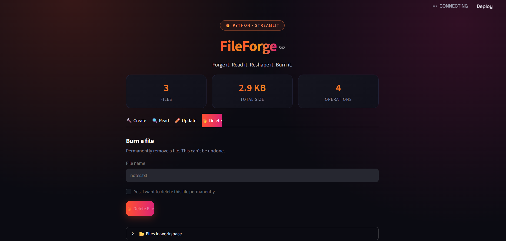

<div align="center">

# 🔥 FileForge

### Forge it. Read it. Reshape it. Burn it.

A sleek, browser-based file management tool built with **Python** and **Streamlit** — turning everyday file operations into a smooth, visual experience.


</div>

---

## 📋 Table of Contents

- [Overview](#-overview)
- [Features](#-features)
- [Demo](#-demo)
- [Tech Stack](#-tech-stack)
- [Installation & Usage](#-installation--usage)
- [Project Structure](#-project-structure)
- [How Each Operation Works](#-how-each-operation-works)
- [UI & Design Philosophy](#-ui--design-philosophy)
- [Error Handling](#-error-handling)
- [License](#-license)
- [Author](#-author)

---

## 🧭 Overview

Working with files — creating them, reading their contents, updating them, deleting them — is one of the first things every programmer learns, and usually one of the first things left behind as a plain, forgettable terminal script. **FileForge** takes that fundamental exercise and turns it into something worth showing off.

At its core, FileForge is a Python file-handling toolkit built around `pathlib.Path`, wrapped in a fully interactive **Streamlit web application**. Instead of typing commands into a terminal, users get a real interface: tabs for each operation, live feedback on every action, a running dashboard of the workspace, and a custom dark, fire-themed design that doesn't look like a default Streamlit app.

The project is intentionally built in two layers:
- A **logic layer** that handles the actual file operations safely, with validation and exception handling at every step, so nothing crashes on bad input.
- A **presentation layer** that turns those operations into an experience — clear feedback messages, a live file preview, confirmation before destructive actions, and visual polish throughout.

The result is a small project that demonstrates a genuinely useful skill set: solid Python fundamentals (file I/O, exception handling, object-oriented `pathlib` usage) paired with the ability to design and build a clean, user-facing interface around them — the kind of full-stack thinking that separates a script from an application.

---

## ✨ Features

| Feature | Description |
|---|---|
| 🔨 **Create** | Instantly creates a new file with content you provide, and blocks accidental overwrites of existing files |
| 🔍 **Read** | Opens a file, displays its contents in a formatted, code-style preview, and lets you download a copy |
| ✏️ **Update** | One tool, three actions — rename a file, append new content to it, or overwrite it entirely |
| 🔥 **Delete** | Removes a file permanently, but only after an explicit confirmation checkbox is ticked |
| 📂 **Live Workspace View** | A real-time list of every file in the working directory, with individual file sizes |
| 📊 **Stat Dashboard** | At-a-glance counters for total files, total storage used, and available operations |
| 🛡️ **Full Error Handling** | Every operation is wrapped in exception handling, so bad input never crashes the app |
| 🎨 **Custom Dark Theme** | A hand-styled interface using gradients, glowing buttons, and a fire-inspired color palette — no default Streamlit look |

---

## 🎬 Demo


*FileForge's dashboard — live file stats, tabbed operations, and a dark, fire-themed interface.*

---

## 🛠 Tech Stack

| Layer | Technology |
|---|---|
| Language | Python 3 |
| File I/O | `pathlib.Path` |
| Web Framework | Streamlit |
| Styling | Custom CSS injected via `st.markdown` |
| Fonts | Space Grotesk, JetBrains Mono (Google Fonts) |

---

## 🚀 Installation & Usage

**1. Install the required package**
```bash
pip install streamlit
```

**2. Launch the app**
```bash
streamlit run fileforge_app.py
```

**3. Open your browser**
Streamlit will automatically open the app at:
```
http://localhost:8501
```

If it doesn't open automatically, just paste that URL into your browser.

---

## 📁 Project Structure

```
FileForge/
│
├── fileforge_app.py     # Main Streamlit application (UI + logic)
├── README.md            # Project documentation
└── LICENSE              # MIT License
```

---

## ⚙️ How Each Operation Works

FileForge is built entirely on Python's `pathlib.Path` object, which provides a clean, object-oriented way to interact with the file system.

### 🔨 Create
- Takes a file name and content from the user
- Checks `path.exists()` to prevent overwriting an existing file
- Writes content using `path.write_text()`

### 🔍 Read
- Verifies the file exists with `path.is_file()`
- Reads and displays the content in a styled, monospace preview box
- Offers a one-click download button for the file

### ✏️ Update
Three sub-operations, selected via a radio toggle:
- **Rename** — `path.rename(new_path)`, blocked if the new name is already taken
- **Append** — opens the file in `"a"` mode and adds new content on a new line
- **Overwrite** — opens the file in `"w"` mode and replaces all existing content

### 🔥 Delete
- Requires the user to tick a confirmation checkbox before the delete button will act
- Uses `path.unlink()` to permanently remove the file
- Includes a safeguard so the app can never delete its own source file

---

## 🎨 UI & Design Philosophy

Rather than using Streamlit's default look, FileForge injects custom CSS to create a distinct visual identity:

- **Fire-toned gradient palette** (orange → pink) used across the title, buttons, and stat cards, tying back to the "forge" theme
- **Dark background with soft radial glows** for depth, instead of a flat solid color
- **Tabbed navigation** instead of a sidebar, keeping all four operations one click away
- **Color-coded feedback** — green for success, red for errors, blue for informational messages
- **Monospace file preview** styled like a code editor, making file content easy to scan

---

## 🛡️ Error Handling

Every operation is wrapped in a `try / except` block, and inputs are validated before any file system action is taken. This means:

- Empty file names are caught before any operation runs
- Attempts to create a file that already exists are blocked with a clear message
- Attempts to read, update, or delete a file that doesn't exist are handled gracefully
- Any unexpected exception is caught and shown to the user instead of crashing the app

---

## 📜 License

This project is licensed under the [MIT License](LICENSE) — free to use, modify, and distribute.

---

## 🙋 Author

**Ayush Kumar**
B.Tech student, Department of AI & ML

- 🔗 GitHub: [ayush-kumar06](https://github.com/ayush-kumar06)
- 💼 LinkedIn: [Ayush Kumar](https://www.linkedin.com/in/ayush-kumar-161380327)
